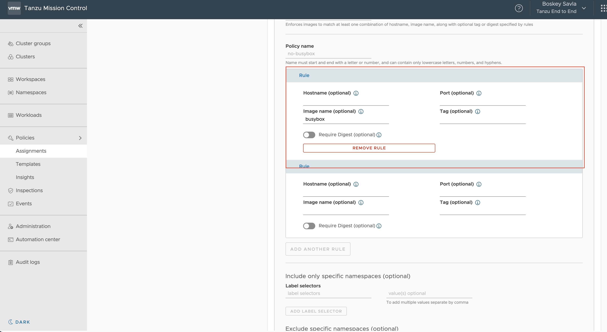

One of the key reason Kubernetes has grown so popular is that it provides application development teams a single API to drive infrastructure according to their application requirements and does so in a simplified manner. Application development teams do not need to understand the nuanced details of the underlying backend infrastructure as Kubernetes focuses on the needs of the application while the integrations focus on the infrastructure team's requirements to provide to them and it does so consistently even if it is a public cloud, private cloud, or on-premises datacenter. If they need a storage volume provisioned or a load balancer provisioned, it's a simple Kubernetes API call away. Kubernetes drives the backend infrastructure based on the API call request and provisions/changes compute, storage and network accordingly.

While this Kubernetes capability makes the day to day lot more streamlined and simplified for application development teams, it also gives Development teams unbound access to the Infrastructure. They can drive as many storage volumes, compute instances or Load Balancers needed, drive external traffic to applications/databases within the security perimeter of an Organization, or expose internal data. They can deploy containers from the internet with vulnerabilities etc. As such, running Kubernetes platform with appropriate polices that implement security best practices is imperative.

1. How do you ensure role based access control is applied consistently?
2. How do you control where container images come from and are deployed to your clusters?
3. How do you ensure network traffic is limited appropriately between pods?
4. How do you allow pods to have the correct level of permissions to the underlying host to function but not more?
5. How can you allow for multi-tenancy within a cluster, allowing teams to consume their share of resources?

Tanzu Mission Control provides out of the box policies that can be applied in a blanket mode to Kubernetes Clusters across multiple cloud and on-prem environments. Tanzu Mission Control also provides a way to build custom polices based on an Organizations unique requirements.

## Implement Secure Access Policy

Kubernetes defines various role based access control policies to its API. Tanzu Mission Control allows a user from a Federated Identity to be mapped to various RBAC polices, providing a way to give right level of API access. We already saw this in the end of the previous chapter.

## Implement Image Registry Policy

The best part about containers is they are ultra-portable. They can be layered like a cake to build brand new images. A container image from the internet can be taken and used to add a new binary to build something custom. That's the appeal of containers. However, this means application development teams can download images from anywhere on the Internet and build new images inheriting vulnerabilities.

There are multiple ways to implement policies that make sure container images that get deployed are safe:

- Implement Vulnerability Scanning in the container Registry that stores the container images, and prevents images with critical vulnerabilities from being deployed (Harbor)
- Implement Policies to not allow images from certain Image Registries (TMC)
- Policy that prevents container images with no digest from deploying (TMC)
- Stop container images with latest tag from deploying (TMC)
- Blacklist certain images/repos (TMC)

Tanzu Mission Control, part of the the Tanzu for Kubernetes Operations solution provides out of the box policies that can be applied to a fleet of clusters spread across multiple clouds.

Tanzu Mission control has Image based policies that can be applied to namespaces within a cluster. These policies can be applied fleet-wide across clusters and clouds by grouping namespaces together in a logical group called **Workspaces**.

- Assuming you are still in **Policies**, click on the **Image Registry** tab and then **Workspaces**

- Select the workspace `tko-demo`

- You will notice a Direct Image Registry Policy applied called `no-busybox`

- Expand the policy `no-busybox` and click **EDIT** then click the first **Rule**

You will notice this is a custom policy that blocks any container image that has the name `busybox` on it:


- An image registry policy can have multiple rules. Take a look at the other attributes of image registry policies that can be applied as a rule.

Let's validate that our image registry policy is working by trying to deploy the `busybox` image on the namespace `tko-image-policy` which is part of the cluster `gke-psp-demo`.

- Go to the **Workshop** tab so you can see the **Terminal**.

- (Optional) Make sure the namespace `tko-image-policy` exists on the cluster
```execute
kubectl --kubeconfig=kubeconfig-gke-psp-demo.yaml get ns
```

- Create a deployment with the image `busybox` from Docker Hub
```execute
kubectl --kubeconfig=kubeconfig-gke-psp-demo.yaml create deployment busybox-{{session_namespace}} --image=busybox -n tko-image-policy
```

- Notice the deployment is blocked and won't progress because of the image rules:
```execute
kubectl --kubeconfig=kubeconfig-gke-psp-demo.yaml get events --field-selector type=Warning -n tko-image-policy
```
  Notice the admission webhook enforces the policy that has been set, blocking the deployment with `busybox`.

- Delete the deployment
```execute
kubectl --kubeconfig=kubeconfig-gke-psp-demo.yaml delete deployment busybox-{{session_namespace}} -n tko-image-policy
```

## Implement Network Policies

By default, Kubernetes provides an open, flat network which is often not desirable. Many applications, especially when we are running microservices, only need to communicate to a few other services. Network policies allow us to define some default network rules on Workspaces to control the flow of network traffic for the services communicating in and out of a cluster.

To view these policies:

- Click on **Network** tab within the policy assignments section.

- Click on **Workspaces** as network policies can only be applied to workspaces.

- Click **Create Network Policy** to view the wizard, reviewing the options in the Network policy dropdown.

**Note**: In order for network policies to be effective, the CNI deployed to your Kubernetes cluster must support network policies.

## Implement Security Policies

Containers are the base unit of deployment that runs any application on Kubernetes. Containers are processes that run on a given Kubernetes Host, they can have access to the host file systems, networks, host namespaces, password files, listen to traffic on the host etc. An application running in a container can see host/system level objects. To prevent containers from doing so, Kubernetes has created Admission Controllers that check the provisioning of a pod based on a set of Pod Security Policies (PSPs). It is important to not let containers access host based resources unless necessary as doing so opens unnecessary potential attack vectors. By default, Kubernetes does not implement any pod security policies.

By default, Tanzu Mission Control implements security policies around running pods with root access, privileged mode, access to host networks, volumes etc.

To view these policies:

- Click on the **Security** tab within the policy assignments section and click on the **Clusters** view if you are still seeing **Workspaces**.

- Click on the root of the **Clusters** tree, on **Tanzu End to End**

- Select the **Direct Policy** applied, `dhubao-strict` then click **edit**

Review the Security Policies applied to all clusters in the entire organization.

Let's validate this by trying to deploy a container that needs privileged access to run.

- On the **Security** tab, expand the Cluster Group `e2e-amer` and notice that cluster group has the policy `dhubao-strict` applied as an Inherited security policy.

- Click on the Cluster Group `tko-psp-demo` and notice the Direct policy on it called `psp-strict`.

- Edit this policy by clicking on it and selecting **edit**, notice this policy enforces the `Strict` default security template.

Now we will deploy an app with root privileges on the cluster `e2e-amer` that has no default security policy enabled.

- Go to the workshop tab, on the **Terminal** Tab
```execute
kubectl create deployment nginx-{{session_namespace}} --image=nginx -n {{session_namespace}}
```

- Notice the pods do get created because a default security policy is not enabled on this cluster.
```execute
kubectl get pods -n {{session_namespace}}
```

Now let's deploy the same app with root privileges on the cluster `gke-psp-demo` which is part of the Cluster Group `tko-psp-demo`. This Cluster Group and hence the cluster has `psp-strict` security policy enabled on it.

- Deploy the same `nginx` application on this cluster
```execute
kubectl --kubeconfig=kubeconfig-gke-psp-demo.yaml create deployment nginx-{{session_namespace}} --image=nginx
```

- Notice that the admission webook blocks the creation due to privilege escalation being blocked:
```execute
kubectl --kubeconfig=kubeconfig-gke-psp-demo.yaml get events --field-selector type=Warning
```

This is because the security policy is enabled on the cluster is blocking any cluster needing privileged mode/root access implemented by Tanzu Mission Control.

- Delete the deployment
```execute
kubectl --kubeconfig=kubeconfig-gke-psp-demo.yaml delete deployment nginx-{{session_namespace}}
```

## Implement Quota Policies

Application development teams love Kubernetes cause they can request infrastructure resources like compute, network and storage for running their apps without having to deal with Operations team or raise a ticket to provision things. On the flip side, this means the teams managing the platform need to be aware of the capacity they have and implement any quota/restrictions on consumption. Tanzu Mission Control's Quota based policy allows you to do just that from an operations perspective.

- Go to the tab with Tanzu Mission Control, click on **Policies** then **Assignments**

- Click on the tab **Quota**, select **Cluster** then click on **Cluster Group** > `tko-psp-demo`

- Notice the Direct Quota Policy applied `quota-large`. Expand it and click **EDIT**

- Notice it has been assigned an quota to limit of 2 vCPU and 2 GB of memory per workload.

- You can opt to create a custom policy if you don't want to use any of the pre-defined ones or you wish to implement more detailed policies on objects such as: CPU, memory, storage, or even limits on most Kubernetes objects within a namespace.

Once complete, exit out of the wizard.

## Implement Mutual TLS (mTLS) for Application Services across Multiple Clouds

If you have developed an application from the ground up to be cloud native and easily portable across clouds, you often have a lot of flexibility when it comes to where you deploy.  But from what we've seen, that isn't most applications.  You have issues of data gravity that keep certain services more tied to a specific deployment location.

You also want to be able to leverage the best of breed services that every cloud has to offer no matter which cloud it is on.

But getting the services on one cloud to work with services deployed on a different cloud can be challenging.  Every cloud has its own methods of configuring networking and the complexity can be daunting.  It can be difficult manage the protection of your data in flight all the way from the source application to the destination and back.  And you don't have time to go back and redesign your applications to do all this.

Tanzu makes the process of connecting applications running across clouds simple for operations and applications teams by grouping all those services into a global namespace that spans multiple clusters.  By leveraging open source projects like Istio, Tanzu enables applications to discover remote services through DNS.  It routes network traffic to remote clusters, and manages mTLS encrypted links between clouds that ensure your data is always protected without having to implement mTLS directly in the application layer itself.

- Click on the tab for **Tanzu Service Mesh**

- Show the **Global Namespace** named `e2e-demo`. Point out this application is running on one cluster running TKG in AWS (`e2e-acme`) and one cluster that is running on EKS (`e2e-catalog`).

- Show that we have an ingress gateway that is the main ingress for the application (`istio-ingressgateway`).  Highlight that the `catalog` service is running in the `e2e-catalog` cluster, and that we can see an mTLS protected, cross-cluster link between the `shopping` service and the `catalog` service.  No special rules had to be created to enable this and this link is being completely managed by Tanzu Service Mesh.

- Hover over the `catalog` service name in the graph and show the performance stats.  The value of exposing these KPIs right in the Service Mesh interface is to speed troubleshooting.

- Next, let's look at how global namespaces are set up.  Click on the **Edit** button for the `e2e-demo` global namespace.  On the first page of the dialog, highlight that the **Domain** field is an arbitrary domain that you will use to refer to all the services in that namespace.  It doesn't need to be a registered domain, as this name is only used by services in the namespace to reach each other.  That domain is simply a signal to the mesh that it needs to look in the global namespace to resolve that domain name.
  - **Note**: it is a best practice to utilize at least a subdomain that is not in use as if it is a DNS name that is in use, internal services to the cluster will not be able to reach those external DNS names as they will be intercepted by the service mesh and treated as internal DNS names only.

- Click **Next** to go to the **Service Mapping** dialog.

- In the **Service Mapping** dialog, highlight the mapping rules that onboard services into the new global namespace.  Point out we've selected a cluster and namespace combination for both clusters.  Open up the **Service Preview** section on each mapping rule to show the services that are mapped in.

- Click on the **Cancel** button to exit the dialog.

And there you have it! Tanzu Service Mesh let's you create global services across clusters and enable mTLS between services.
