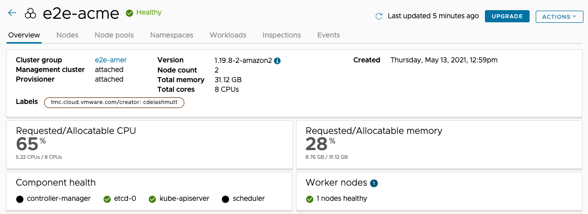

Applying patches, performing regular upgrades and backups are very critical to maintaining platforms. Tanzu for Kubernetes Operations provides a easy way of performing Upgrades and backups for any kind of cluster in any cloud.

## Backup Kubernetes Clusters

Development teams may get into a situation where for various reasons, they may want to restore the cluster's resources to a specific time.  Tanzu Mission Control can help backup an entire cluster or a specific namespace from within a cluster. Backup target locations can be AWS S3 or any S3 compatible storage location. Backup target locations can be setup for a fleet of clusters in a Cluster Group providing efficiency of configuration. Tanzu Mission Control also provides a simple interface to setup schedules for backups or trigger a backup anytime.

Go to the tab with Tanzu Mission Control on it:

- Click on **Administration** > **Target locations** and review the locations listed.  Each one is a S3 backup target where the data will be stored.
- Click **Create Target Location** > **AWS S3** > select `end-to-end-dataprotection` in the credential section
- Add the cluster groups you wish to include - you can select multiple
- Give it a name and that's all there is to creating a new target location.

**Warning**: Do not click **Create**.

Let's take a look at the backup and restore functions:

- Click **Cluster Groups** > `e2e-amer` and select the `e2e-amer` cluster.
- Click **Create Backup** and select what to backup
- Select the target location. (there may only be one to choose from)
- Select when to perform the backup.
- Set the backup retention period.
- Instead of giving it a name and executing the backup, click the back button and then navigate to the **Data protection** tab of the `e2e-amer` cluster which will list all of the recent backups.
- To restore a backup, select one from the list and click "Restore Backup" and the restore wizard comes up.

**Warning**: Do not actually restore the backup to the cluster!

- Notice you can select to restore the entire cluster, a namespace or a specific resource.
- Click **Cancel** to exit out of the wizard.

## Upgrades

Tanzu Mission Control also provides an efficient way to upgrade Kubernetes versions of a manged workload/management cluster.

- Clicking into the cluster **Overview**, there will be an **Upgrade** button next to the **Actions** button.
- From there, you can select which version you wish to upgrade to.
- Doing so will perform a rolling upgrade across the cluster, replacing a node at a time with the new version.
- Your cloud native applications will have their pods rescheduled across the cluster as the rolling upgrade occurs.

