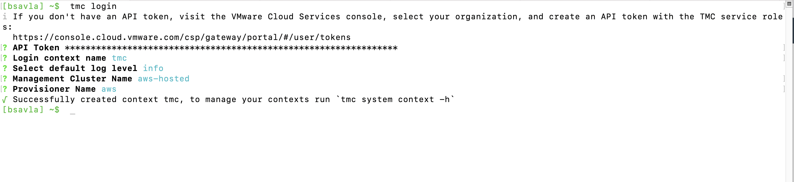

We are going to use Tanzu Mission control to build, manage lifecycle and backup Kubernetes clusters across multiple cloud providers. We will then implement policies that will help provide self-service role based access to developers, secure container runtime, forward metrics to Tanzu Observability and implement Secure communications on application services running on top of these clusters using Tanzu Service Mesh.

# SaaS Services
**Important**: For the next sections, it is vital that you  make sure to sign-in to cloud.vmware.com with your **@vmware.com** email address and select the **Tanzu End to End** organization.  Please be careful not to alter the services or configurations of the clusters in these environments as they are shared for the entire End to End Demo Environment.

Click below to sign in.  If you can't see this organization, you can self-enroll into the organization at https://via.vmware.com/tanzu-e2e-demo
```dashboard:open-url
url: https://console.cloud.vmware.com
```

## Tanzu Mission Control

Open a tab for Tanzu Mission Control
```dashboard:open-url
url: https://tanzuendtoend.tmc.cloud.vmware.com/clusters
```

## Workload Cluster kubeconfig

You will need a kubeconfig from the `gke-psp-demo` cluster if you wish to validate the policies set in Tanzu Mission Control.  To fetch a kubeconfig:

- Go to the the Tanzu Mission Control tab, locate the cluster `gke-psp-demo` under the clusters page and click on it.
- Click Actions from the top right hand side of the page and click **Access This Cluster**
- Click on **view YAML**
- Copy the YAML config, there is a small button to copy the entire text.
- Click **OK** button.
- Go to the **Workshop** tab, paste the value in a config file, the below command will open an editor
```editor:append-lines-to-file
file: ~/kubeconfig-gke-psp-demo.yaml
text: |
```

- Once the empty file appears, paste the contents of the kubeconfig copied from the previous steps.
  - **Note**: Once pasted, make sure to hit `ctrl+s` to save

- Login to TMC using the CLI, go back to Tanzu Mission Control tab
```execute
tmc login
```

- In Tanzu Mission Control, fetch an API Token by clicking on the dropdown of your username in the top right hand corner, click **My Account**, click on the **API tokens** tab, click on **Generate a new API Token**. If you need to re-issue an existing token, click on **REGENERATE** to create a new one and and copy the generated token then, click **Continue**.
- Go back to the Workshop page, on the **Terminal** tab
- When Prompted to provide the API Token, paste the API token you just copied. Give a context name like `tmc-tko` and `aws-hosted` for **Management Cluster Name** and `aws` for **Provisioner Name**, like shown in the below snapshot.



## Tanzu Observability
Open a tab to Tanzu Observability for your Pet Clinic Dashboard.  First, you will need to sign in to the following Wavefront instance.
```dashboard:open-url
url: https://vmware.wavefront.com/dashboards/integration-kubernetes-clusters#_v01(p:(cluster_name:(m:(Label:'e2e-amer.attached.attached.tmc'),s:Label)))
```

If you are having trouble accessing this instance, make sure you have the Wavefront-sandbox app added to your Workspace One account.  You can access that app at https://myvmware.workspaceair.com/catalog-portal/ui#/apps/details/WORKSPACE-d689139a-9b94-4b6f-aa23-915763e9b149-Web-Saml20, and then try to click the link above.

## Tanzu Service Mesh
Open tab to Tanzu Service Mesh to the `e2e-demo` Global namespace by clicking the link below.  If you don't see the graph for the Global Namespace showing the `e2e-acme` and `e2e-catalog` clusters, make sure to select the **Tanzu End to End** org, close the tab, and then reopen it again with the link below.
```dashboard:open-url
url: https://prod-2.nsxservicemesh.vmware.com/global-namespaces-detail/e2e-demo/gns-topology
```

# Tab Staging
Reorder your tabs in this way so that your demo flow goes left to right:
* This workshop
* TMC
* TO
* TSM
