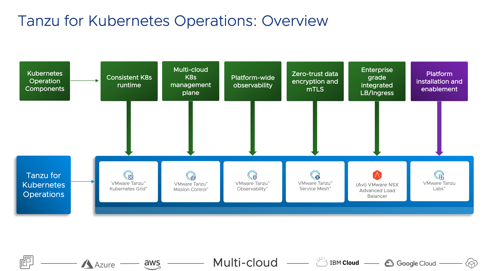

Tanzu for Kubernetes Operations helps operations team build, manage, secure and monitor  consistent Kubernetes platform at scale across on-premises, public clouds, and edge.

On Day 0,

- Tanzu for Kubernetes operations helps deploy consistent, scalable Kubernetes clusters that automatically install Cloud/infrastructure specific Kubernetes Drivers like CNI, CSI such that the clusters are ready and can cater to development teams needs around provisioning persistent storage volumes and Networking Services.

For Day 1,

- Development teams can be given Role based Access Control (RBAC) to clusters authenticated via an Identity provider. Development teams can then access these clusters in a self-service manner. 
- Baseline policies around security, access, quota can be quickly applied to cluster across multiple-clouds at once using logical groups.
- Automate collecting backups of Kubernetes clusters

For Day 2,

- Operation teams can monitor metrics across the full stack , including applications deployed by dev teams.
- Collect and analyze logs centrally.

Day n,

- Upgrade Clusters to the latest Kubernetes Version automatically
- Provide/Restore clusters from backup 

This demo will walk you through the important capabilities that TKO provides to support the outcomes you are striving for in your application modernization efforts.
