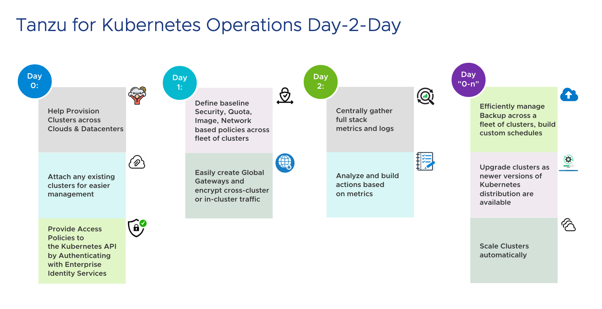

Tanzu for Kubernetes Operations helps operations team build, manage, secure and monitor consistent Kubernetes platform at scale across on-premises, public clouds, and edge.

**Day 0** - standardize cluster provisioning and enable developer self-service access to Kubernetes clusters across multi-cloud environments

- Tanzu for Kubernetes operations helps deploy consistent, scalable Kubernetes clusters that automatically install cloud/infrastructure specific Kubernetes drivers like CNI, CSI such that the clusters are ready and can cater to development teams needs around provisioning persistent storage volumes and networking services.
- Development teams can be given role based access control (RBAC) to clusters authenticated via an identity provider. Development teams can then access these clusters in a self-service manner.

**Day 1** - Implement Access, Security, Quota and Backup Policies

- Baseline policies around security, access, quota can be quickly applied to cluster across multiple-clouds at once using logical groups.
- Automate collecting backups of Kubernetes clusters

**Day 2** - Monitor & Analyse Full stack Metrics and Logs.

- Operation teams can monitor metrics across the full stack, including applications deployed by dev teams.
- Collect and analyze logs centrally.

**Day 0-n** - Cluster Maintenance and Lifecycle Management

- Upgrade Clusters to the latest Kubernetes version automatically
- Scale clusters based on demand
- Backup/restore cluster resources including persistent volumes

This demo will walk you through the important capabilities that are available in Tanzu for Kubernetes Operations.
